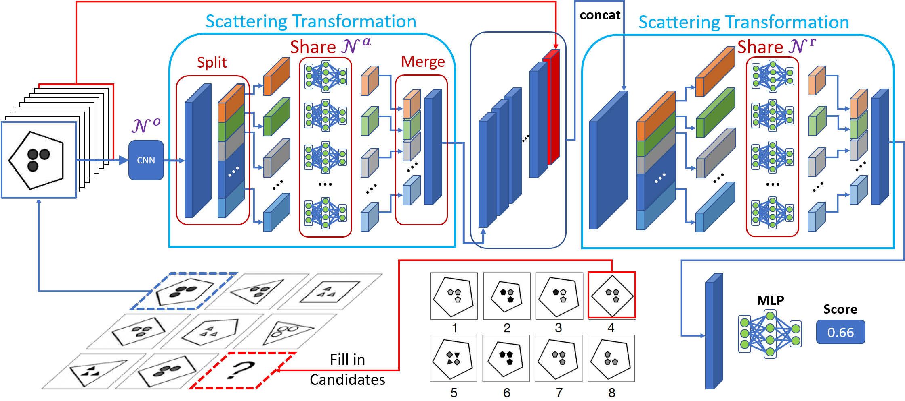

# The Scattering Compositional Learner: Discovering Objects, Attributes, Relationships in Analogical Reasoning

PyTorch implementation for The Scattering Compositional Learner (SCL). 

<div align="center">
  
</div>

SCL is a neural architecture for discovering the underlying compositional structure of the data. We applied the proposed method to an analogical reasoning task, Raven’s Progressive Matrices, which exhibits strong compositional structures. SCL achieved state-of-the-art performance in two datasets, with a 48.7% relative improvement on Balanced-RAVEN and 26.4% on PGM. We validated the learned compositional structure by showing that the neural representation matches the symbolic representation of attribute concepts up to a linear transformation, and well-separated relationship clusters in a t-SNE plot.

**[The Scattering Compositional Learner: Discovering Objects, Attributes, Relationships in Analogical Reasoning](https://arxiv.org/abs/2007.04212)**
<br />
[Yuhuai Wu](http://www.cs.toronto.edu/~ywu/)\*,
[Honghua Dong](http://dhh1995.github.io/)\*,
[Roger Grosse](http://www.cs.toronto.edu/~rgrosse/),
[Jimmy Ba](https://jimmylba.github.io/),
<br />
(\*: indicates equal contribution.)
<br />
[[Paper]](https://arxiv.org/pdf/2007.04212.pdf)


## Requirements
* Python 3
* pytorch
* matplotlib
* tqdm
* PIL
* sklearn
* [Jacinle](https://github.com/vacancy/Jacinle) (third party, we use the version [c9fcbb5](https://github.com/vacancy/Jacinle/tree/c9fcbb55c73679ff17488f10b71b574a2ca044d2) for this repo).

## Dataset
* [RAVEN](https://github.com/WellyZhang/RAVEN)

## Installation

First get this repository and git clone [Jacinle](https://github.com/vacancy/Jacinle). You need to add the bin path to your global `PATH` environment variable:

```
export PATH=<path_to_Jacinle>/bin:$PATH
```

Create a conda environment, and install the requirements. This includes the required python packages
from both Jacinle and this repo. Most of the required packages have been included in the built-in `anaconda` package:

```
conda create -n pytorch anaconda
conda install pytorch torchvision -c pytorch
```

## Usage

First prepare the RAVEN dataset following the instruction of the [repo](https://github.com/WellyZhang/RAVEN).
Assume the dataset dir is `~/data/RAVEN-10000`.

### Single Task Training

``` shell
# prepare dataset:
$ python3 scripts/preprocess.py -d ~/data/RAVEN-10000 -t center_single -n 1000 -v
# single training:
$ jac-run main.py -d ~/data/RAVEN-10000 -t center_single --use-gpu -v \
-lr 0.005 -vlr 0.005 -wd 0.01 -tsd 80 -fg 10 -nf 80 \
-chd 16 16 32 32 -rb -erb -vhd 128 -hd 64 32 -lhd 128
```

### Joint Training

``` shell
# prepare dataset:
$ python3 scripts/preprocess.py -d ~/data/RAVEN-10000 \
-t center_single left_right up_down in_out \
distribute_four distribute_nine in_distri -n 1000 -v -nsr
# joint training:
$ jac-run main.py -d ~/data/RAVEN-10000 -t center_single left_right \
up_down in_out distribute_four distribute_nine in_distri --use-gpu -v \
-lr 0.005 -vlr 0.005 -wd 0.01 -tsd 80 -fg 10 -nf 80 \
-chd 16 16 32 32 -rb -erb -vhd 128 -hd 64 32 -lhd 128
```

### Useful Args
- `-t`: specify the task, choices are `['center_single', 'left_right', 'up_down', 'in_out', 'distribute_four', 'distribute_nine','in_distri']`, when multiple ones are provided, it becomes jointly over multiple tasks.
- `-v`: take visual inputs.
- `-vlr`: learning rate for visual model. (smaller `vlr` sometimes help)
- `-lr`: learning rate for anywhere else.
- `-wd`: weight decay.
- `-tsd` & `-fg`: the args of the visual model, related to the number of splited groups.
- `-chd`: the hidden dims of convnet.
- `-rb` & `-erb`: enable the residual blocks.
- `-vhd`, `-hd`, `-lhd`: the hidden dims of different modules.
- `--dump-dir, -du DUMP_DIR`: place to dump logs/summaries/checkpoints.
- `--load, -l SAVED_CKPT`: load from checkpoint.
- `--test, -test` & `--use-test-as-val, -tv`: test on test dataset.
- `--test-obs, -to` & `--obs-lr, -olr OBS_LR`: do observation for intermediate representation w.r.t to the ground truth features. (Recommand OBS_LR to be 0.2 - 0.5)

For a complete command-line options see `jac-run main.py -h`.
